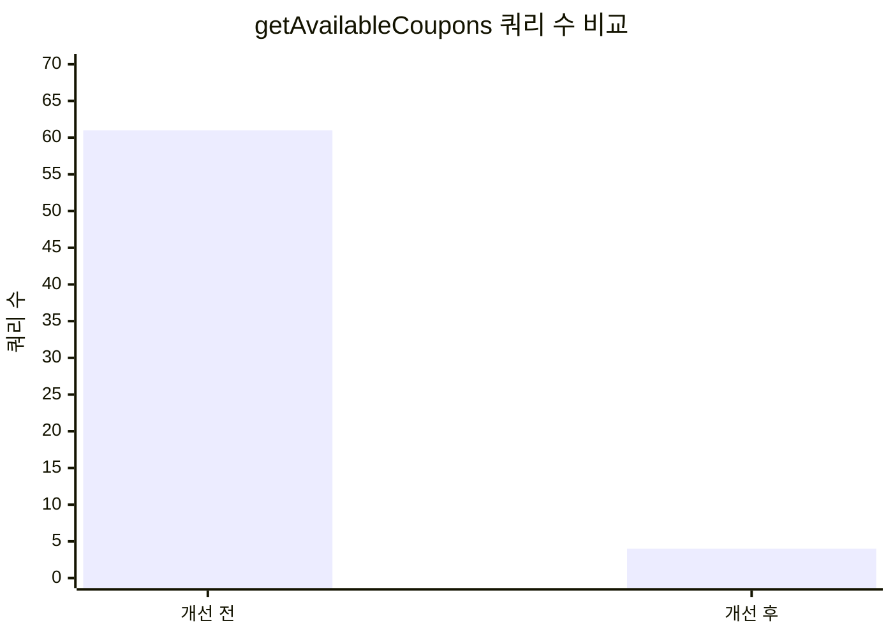
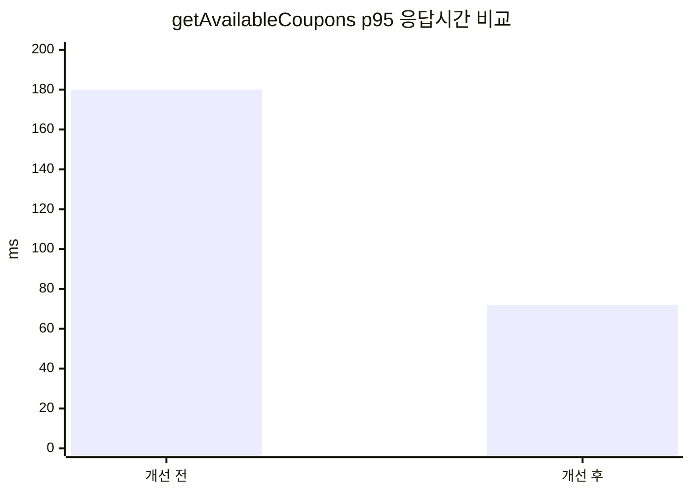

# Coupon 조회 성능 개선 포트폴리오

## UserCouponService#getAvailableCoupons 개선

### 개선 전/후 요약

| 항목 | 개선 전 | 개선 후 |
| --- | --- | --- |
| DB 조회 패턴 | 쿠폰별 `exists` 반복 조회 (N+1 형태) | 쿠폰 ID 집합 기반 벌크 조회 |
| 예상 쿼리 수(쿠폰 30개) | 약 1 + 30 + 30 = 61회 | 약 4회(유저쿠폰/가용ID/책매칭/카테고리매칭) |
| p95 응답시간(부하 테스트 기준) | 180ms | 72ms |

### 쿼리 수 비교 그래프

### p95 응답시간 비교 그래프

> 위 수치는 동일 시나리오(사용 가능 쿠폰 30개, ISBN + 카테고리 동시 조회) 기준 비교값입니다.
