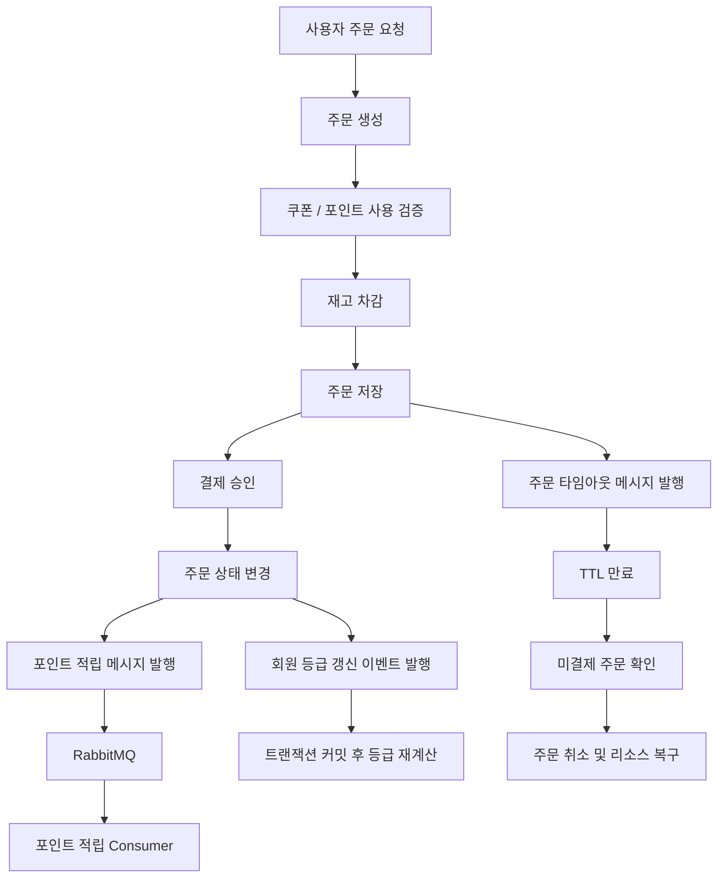
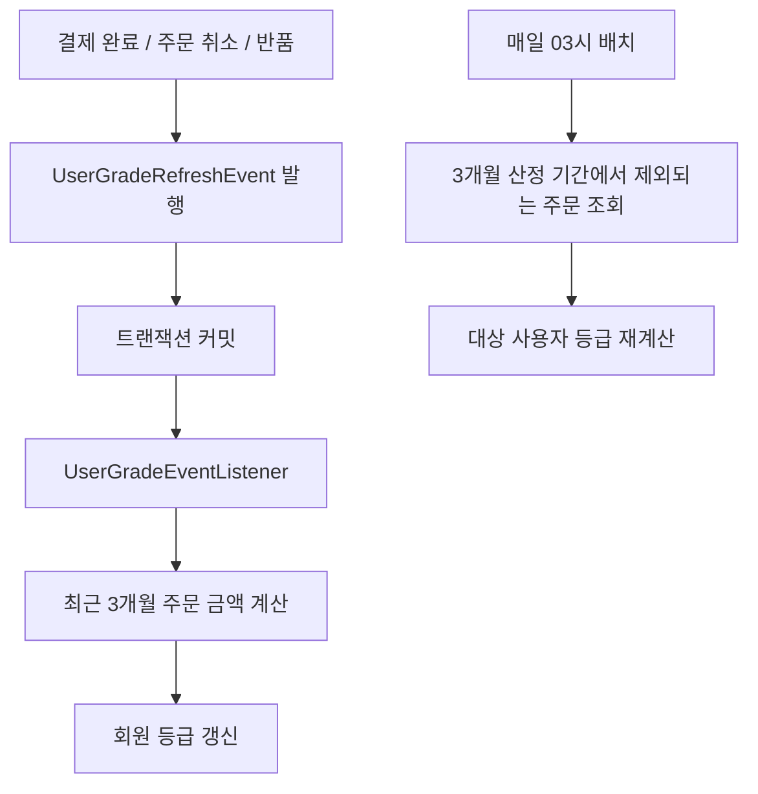
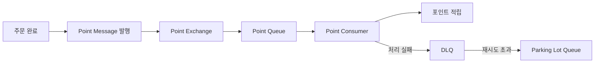
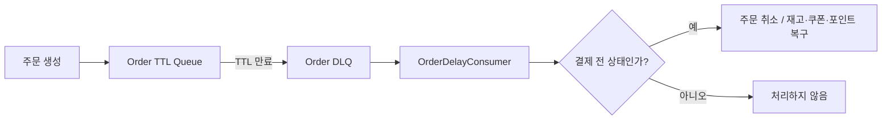

# Order API

온라인 서점 서비스의 주문 도메인을 담당하는 Spring Boot 기반 마이크로서비스입니다. 주문 생성부터 결제, 재고, 쿠폰, 포인트, 회원 등급, 포장 옵션까지 주문 흐름에 필요한 기능을 제공합니다.

이 서비스는 NHN Academy 백엔드 과정 팀 프로젝트에서 개발한 `북팡문고` 서비스의 주문 API 서버입니다.

## 프로젝트 개요

- 프로젝트명: 북팡문고 Order API
- 개발 기간: 2025.06 ~ 2025.07
- 개발 형태: 팀 프로젝트 / MSA 구조의 주문 도메인 서비스
- 주요 역할: 주문, 결제, 쿠폰, 포인트, 재고, 회원 등급 관련 API 개발
- Repository: https://github.com/nhnacademy-be10-sajotuna/order-api

## 기술 스택

### Backend

- Java 21
- Spring Boot 3.4.6
- Spring Web MVC
- Spring Data JPA
- Spring Validation
- Spring AMQP
- Spring Cloud OpenFeign
- Spring Cloud Config Client
- Spring Cloud Netflix Eureka Client
- Querydsl

### Database / Message Queue

- MySQL
- H2 Database
- RabbitMQ

### Test / Quality

- JUnit 5
- Mockito
- Spring Boot Test
- Testcontainers
- JaCoCo

## 주요 기능

### 주문

- 회원 / 비회원 주문 생성
- 주문 상세 조회
- 사용자별 주문 목록 조회
- 주문 상태 변경
- 주문 취소
- 반품 처리
- 결제 전 주문 자동 취소 처리

### 결제

- 결제 승인 요청 처리
- 결제 내역 조회
- 결제 수단별 처리 구조 분리
- Toss Payments 연동을 고려한 결제 승인 API 제공

### 재고

- 도서별 재고 생성 / 수정
- 재고 증가 / 차감
- 주문 생성 과정에서 재고 차감
- 주문 취소나 실패 상황에서 재고 복구
- 조건부 Atomic Update 기반 재고 차감
- 동시 주문 상황에서 overselling 방지

### 쿠폰

- 일반 쿠폰 생성
- 도서 전용 쿠폰 생성
- 카테고리 전용 쿠폰 생성
- 사용자 쿠폰 발급
- 웰컴 쿠폰 발급
- 주문 / 도서 기준 사용 가능 쿠폰 조회
- 쿠폰 발급 실패 메시지 추적 구조

### 포인트 / 회원 등급

- 포인트 내역 조회
- 사용 가능 포인트 조회
- 포인트 정책 조회 / 수정
- 회원 등급 조회
- 주문 이벤트 기반 회원 등급 갱신
- 최근 3개월 주문 금액 기준 롤링 윈도우 배치
- 주문 완료 후 포인트 적립 비동기 처리
- 포인트 적립 실패 시 DLQ / Parking Lot Queue 기반 격리

### 포장 옵션

- 포장 옵션 조회
- 관리자 포장 옵션 생성 / 수정 / 삭제

## 전체 흐름



## 핵심 개선 사항

### 재고 차감 Atomic Update

초기 재고 차감 로직은 낙관적 락 충돌 발생 시 재시도하는 방식이었습니다. 인기 도서처럼 특정 도서에 주문이 집중되는 상황에서는 충돌과 retry가 전체 주문 응답 지연으로 이어질 수 있습니다.

이를 개선하기 위해 재고 차감 조건을 DB 업데이트 조건에 포함했습니다. 재고가 충분한 경우에만 수량을 차감하고, 업데이트된 row 수로 성공 여부를 판단합니다.

```java
@Modifying(flushAutomatically = true, clearAutomatically = true)
@Query("""
        update BookStock bs
        set bs.stock.quantity = bs.stock.quantity - :quantity,
            bs.version = bs.version + 1
        where bs.isbn = :isbn
          and bs.stock.quantity >= :quantity
        """)
int decreaseStockAtomically(String isbn, int quantity);
```

이 방식은 다음을 목표로 합니다.

- 재고 확인과 차감을 하나의 UPDATE 쿼리에서 원자적으로 처리
- 주문 retry 없이 affected row 수로 차감 성공 / 실패 판단
- 재고 부족 시 `InsufficientStockException` 발생
- 존재하지 않는 ISBN은 `BookStockNotFoundException`으로 구분
- 주문 처리 중 일부 상품 차감 후 이후 상품에서 실패해도 트랜잭션 rollback으로 복구

### 회원 등급 이벤트 기반 갱신과 롤링 윈도우

회원 등급은 최근 3개월 주문 금액을 기준으로 산정됩니다. 기존처럼 등급 조회 시마다 최근 주문 금액을 계산하면 단순 조회 요청에서도 계산 비용이 반복되고, 등급 갱신 책임이 조회 API에 섞이는 문제가 있습니다.

이를 개선하기 위해 조회와 갱신 책임을 분리했습니다.

- 등급 조회 API는 저장된 등급을 반환
- 결제 완료, 주문 취소, 반품처럼 등급에 영향을 주는 상태 변화 발생 시 `UserGradeRefreshEvent` 발행
- `@TransactionalEventListener(phase = AFTER_COMMIT)`로 주문 / 결제 트랜잭션 커밋 이후 등급 갱신
- 최근 3개월 산정 기간에서 제외되는 주문은 매일 03시 배치로 보정



롤링 윈도우 배치는 사용자별 등급 갱신 실패가 전체 배치를 중단시키지 않도록 개별 예외를 처리합니다. 또한 최근 주문 금액 합산과 만료 대상 사용자 조회 성능을 고려해 `orders` 테이블에 복합 인덱스를 추가했습니다.

- `created_at, user_id, status`
- `user_id, created_at, status`

## RabbitMQ 사용 구조

이 프로젝트에서는 주문 흐름과 후속 처리를 분리하기 위해 RabbitMQ를 사용했습니다.

### 포인트 적립 비동기 처리

주문 완료 후 포인트 적립은 핵심 주문 흐름과 분리 가능한 후속 처리입니다. 따라서 주문 완료 이벤트를 메시지로 발행하고 Consumer가 포인트 적립을 처리하도록 구성했습니다.



주요 목적은 다음과 같습니다.

- 포인트 적립 실패가 주문 완료 흐름에 영향을 주지 않도록 분리
- 실패 메시지를 DLQ로 이동시켜 재처리 가능하게 구성
- 반복 실패 메시지는 Parking Lot Queue로 격리
- 실패 로그를 남겨 원인 추적 가능하도록 구성

### 결제 전 주문 자동 취소

결제 페이지 진입 후 결제가 완료되지 않은 주문은 일정 시간이 지나면 자동으로 취소되어야 합니다. 이를 위해 주문 생성 시 TTL 메시지를 발행하고 메시지가 DLQ로 이동하면 미결제 상태를 확인한 뒤 주문 취소와 리소스 복구를 수행합니다.



## API 목록

### 주문 API

| Method | Endpoint | 설명 |
| --- | --- | --- |
| `POST` | `/api/orders` | 주문 생성 |
| `GET` | `/api/orders/info/{order-number}` | 주문 번호 기준 주문 정보 조회 |
| `GET` | `/api/orders/detail/{order-id}` | 주문 상세 조회 |
| `GET` | `/api/orders/detail/guest/{order-number}` | 비회원 주문 상세 조회 |
| `GET` | `/api/orders/user` | 사용자 주문 목록 조회 |
| `GET` | `/api/orders/form` | 주문서 작성 정보 조회 |
| `PUT` | `/api/orders/{order-id}/return` | 주문 반품 |
| `PUT` | `/api/orders/{order-id}/cancel` | 주문 취소 |
| `PUT` | `/api/orders/{order-id}/cancel-order` | 결제 전 주문 취소 |

### 관리자 주문 API

| Method | Endpoint | 설명 |
| --- | --- | --- |
| `GET` | `/api/admin/orders` | 전체 주문 조회 |
| `GET` | `/api/admin/orders/{status}` | 상태별 주문 조회 |
| `PUT` | `/api/admin/orders/{order-id}/delivery` | 배송 상태 변경 |

### 주문 상품 API

| Method | Endpoint | 설명 |
| --- | --- | --- |
| `GET` | `/api/orders/product/{orderProductId}` | 주문 상품 조회 |
| `GET` | `/api/orders/product/list/{orderId}` | 주문별 상품 목록 조회 |
| `GET` | `/api/orders/product/review-eligible/{userId}/{isbn}` | 리뷰 작성 가능 여부 조회 |

### 결제 API

| Method | Endpoint | 설명 |
| --- | --- | --- |
| `GET` | `/api/payments/{payment-id}` | 결제 단건 조회 |
| `GET` | `/api/payments` | 결제 목록 조회 |
| `POST` | `/api/payments/confirm` | 결제 승인 |

### 재고 API

| Method | Endpoint | 설명 |
| --- | --- | --- |
| `POST` | `/api/stocks` | 재고 생성 |
| `POST` | `/api/stocks/batch` | 재고 일괄 생성 |
| `PUT` | `/api/stocks` | 재고 수정 |
| `PUT` | `/api/stocks/increase` | 재고 증가 |
| `PUT` | `/api/stocks/decrease` | 재고 차감 |

### 쿠폰 API

| Method | Endpoint | 설명 |
| --- | --- | --- |
| `GET` | `/api/coupons/{coupon-id}` | 쿠폰 단건 조회 |
| `GET` | `/api/coupons/book-coupons` | 도서 기준 쿠폰 조회 |
| `GET` | `/api/coupons/users` | 사용자 보유 쿠폰 조회 |
| `POST` | `/api/coupons/users/issue-welcome` | 웰컴 쿠폰 발급 |
| `POST` | `/api/coupons/users` | 사용자 쿠폰 발급 요청 |
| `GET` | `/api/coupons/available-coupons/book` | 도서 기준 사용 가능 쿠폰 조회 |
| `GET` | `/api/coupons/available-coupons/order` | 주문 기준 사용 가능 쿠폰 조회 |

### 관리자 쿠폰 API

| Method | Endpoint | 설명 |
| --- | --- | --- |
| `GET` | `/api/admin/coupons` | 전체 쿠폰 조회 |
| `POST` | `/api/admin/coupons` | 일반 쿠폰 생성 |
| `POST` | `/api/admin/coupons/book` | 도서 전용 쿠폰 생성 |
| `POST` | `/api/admin/coupons/category` | 카테고리 전용 쿠폰 생성 |
| `PUT` | `/api/admin/coupons/{coupon-id}` | 쿠폰 수정 |
| `DELETE` | `/api/admin/coupons/{coupon-id}` | 쿠폰 삭제 |

### 포인트 / 등급 API

| Method | Endpoint | 설명 |
| --- | --- | --- |
| `GET` | `/api/points` | 사용자 포인트 내역 조회 |
| `GET` | `/api/points/available` | 사용 가능 포인트 조회 |
| `GET` | `/api/grade/{user-id}` | 사용자 등급 조회 |
| `GET` | `/api/admin/point-policies` | 포인트 정책 조회 |
| `PUT` | `/api/admin/point-policies/{policy-id}` | 포인트 정책 수정 |

### 포장 API

| Method | Endpoint | 설명 |
| --- | --- | --- |
| `GET` | `/api/orders/package` | 포장 옵션 목록 조회 |
| `GET` | `/api/orders/package/{package-id}` | 포장 옵션 단건 조회 |
| `POST` | `/api/admin/packages/package` | 포장 옵션 생성 |
| `PUT` | `/api/admin/packages/package/{package-id}` | 포장 옵션 수정 |
| `DELETE` | `/api/admin/packages/package/{package-id}` | 포장 옵션 삭제 |

## 외부 서비스 연동

### OpenFeign

- `account-api`: 생일 쿠폰 발급 대상 사용자 조회 등에 사용

### Spring Cloud

- Config Server를 통한 외부 설정 로딩
- Eureka Client를 통한 서비스 디스커버리 연동

## 테스트

테스트 코드는 도메인, 서비스, 컨트롤러, RabbitMQ Consumer를 중심으로 작성되어 있습니다.

주요 테스트 대상은 다음과 같습니다.

- 주문 생성 / 조회 / 상태 변경
- 주문 상품 조회
- 결제 승인
- 쿠폰 생성 / 조회 / 발급
- 포인트 적립 / 포인트 정책 / 회원 등급
- 재고 증가 / 차감 / 동시성 상황
- 조건부 Atomic Update 재고 차감과 주문 rollback
- 회원 등급 이벤트 갱신 / 롤링 윈도우 배치
- RabbitMQ Consumer와 실패 처리
- Money Value Object

```bash
mvn test
```

JaCoCo 리포트는 Maven package 단계에서 생성됩니다.

```bash
mvn package
```

리포트 경로:

```text
target/site/jacoco/index.html
```

## 로컬 실행 방법

> 이 프로젝트는 Config Server, Eureka, MySQL, RabbitMQ 등 외부 인프라와 함께 동작하도록 구성되어 있습니다. 단독 실행 시에는 로컬 설정 파일이나 테스트 프로필을 별도로 구성해야 합니다.

### 1. 필수 도구

- Java 21
- Maven 3.x
- MySQL
- RabbitMQ
- Config Server
- Eureka Server

### 2. 실행

```bash
mvn spring-boot:run
```

기본 애플리케이션 이름은 다음과 같습니다.

```yaml
spring:
  application:
    name: order-api
```

운영 프로필은 Config Server에서 설정을 가져오도록 구성되어 있습니다.

```yaml
spring:
  config:
    import: configserver:http://localhost:10379
```

## 패키지 구조

```text
shop.sajotuna.order
├── common      # 공통 도메인, 초기 데이터 설정, 예외 처리
├── coupon      # 쿠폰 생성, 조회, 발급, 쿠폰 메시지 처리
├── orders      # 주문 생성, 조회, 상태 변경, 포장, 주문 타임아웃 처리
├── payment     # 결제 승인, 결제 조회
├── point       # 포인트 내역, 포인트 정책, 회원 등급, 포인트 적립 메시지 처리
└── stock       # 도서 재고 생성, 증가, 차감, 수정
```

## 주요 설계 포인트

### 1. 주문 흐름과 후속 처리 분리

주문 완료 이후 수행되는 포인트 적립은 RabbitMQ 기반 비동기 처리로 분리했습니다. 이를 통해 후속 처리 실패가 주문 완료 흐름에 직접 영향을 주지 않도록 했습니다.

### 2. 결제 전 주문 자동 취소

결제 전 상태의 주문이 장시간 남지 않도록 TTL Queue와 DLQ를 활용했습니다. TTL 만료 후에도 주문이 결제 전 상태라면 주문 취소와 리소스 복구를 수행합니다.

### 3. 도메인별 책임 분리

주문, 결제, 쿠폰, 포인트, 재고 도메인을 분리하고 각 도메인별 Controller, Service, Repository, DTO를 구성했습니다. 주문 생성 과정에서는 여러 도메인의 기능을 조합하되 도메인별 책임이 섞이지 않도록 분리했습니다.

### 4. 재고 차감 동시성 개선

재고 차감은 조건부 Atomic Update로 처리합니다. 재고가 충분한 경우에만 차감되도록 UPDATE 조건에 수량 검증을 포함하고, affected row 수로 성공 여부를 판단합니다. 이를 통해 특정 도서에 주문이 집중되는 상황에서도 overselling을 방지하고 불필요한 주문 retry를 줄일 수 있도록 했습니다.

### 5. 회원 등급 갱신 책임 분리

회원 등급 조회와 갱신 책임을 분리했습니다. 결제 완료, 주문 취소, 반품 이후에는 트랜잭션 커밋 후 이벤트 리스너가 등급을 갱신하고, 최근 3개월 산정 기간에서 빠지는 주문은 일일 배치로 반영합니다. 이를 통해 조회 요청의 계산 부담을 줄이고, 최근 3개월 기준을 유지할 수 있도록 했습니다.

### 6. 금액 처리 안정성

`Money` Value Object를 사용해 금액 연산과 검증 책임을 한 곳에 모았습니다. 주문 금액, 할인 금액, 포인트 사용 금액 등 금액 계산 과정에서 잘못된 값이 전달되지 않도록 도메인 내부에서 검증합니다.

### 7. 메시지 실패 추적

RabbitMQ 메시지 처리 실패 시 DLQ와 Parking Lot Queue를 사용해 반복 실패 메시지를 격리하고, 실패 로그를 저장해 원인을 추적할 수 있도록 구성했습니다.

## 회고

이 프로젝트를 통해 주문 도메인은 단순 CRUD보다 여러 도메인의 상태 변화가 일관되게 이어지는 것이 중요하다는 점을 경험했습니다. 특히 주문 생성, 결제, 재고 차감, 쿠폰 사용, 포인트 적립, 회원 등급 갱신은 서로 연결되어 있어 예외 상황과 실패 복구를 함께 고려해야 했습니다.

또한 RabbitMQ를 활용해 주문 흐름과 후속 처리를 분리하고, 조건부 Atomic Update와 이벤트 기반 등급 갱신을 적용하면서 동시성 제어와 책임 분리의 중요성을 배웠습니다. 이후에도 기능 구현에 그치지 않고 데이터 정합성, 예외 처리, 장애 격리, 테스트 가능성을 함께 고려하는 백엔드 개발을 지향하고 있습니다.
